# Лабораторная работа
# Тема: "Хеш-таблица"
<br>

### Александров Олег
### Б05-331 
### 11.04.2024 

<br>

# Содержание
1. [Теоретическая справка](#теоретическая-справка)
2. [Цель работы](#цель-работы)
3. [Сравнительный анализ хеш-функций](#сравнительный-анализ-хеш-функций)
    1. [Реализация хеш-функций](#реализации-хеш-функций)
    2. [Описание эксперимента](#описание-эксперимента)
    3. [Подготовка базы данных](#подготовка-базы-данных)
    4. [Выбор размера хеш-таблицы](#выбор-размера-хеш-таблицы)
        1. [Хеш-функция, которая возвращает константу](#хеш-функция-возвращает-константу)
        2. [Хеш-функция, которая возвращает ASCII код первого символа](#хеш-функция-возвращает-ascii-код-первого-символа-в-слове)
        3. [Хеш-функция, которая возвращает длину слова](#хеш-функция-возвращает-длину-слова)
        4. [Хеш-функция, которая возвращает сумму ASCII кодов в слове](#хеш-функция-№4-возвращает-сумму-ascii-кодов-в-слове)
        5. [Хеш-функция, которая возвращает RorHash](#хеш-функция-возвращает-RorHash)
        6. [Хеш-функция, которая возвращает RolHash](#хеш-функция-возвращает-RolHash)
        7. [Хеш-функция, которая возвращает CRC32Hash](#хеш-функция-возвращает-CRC32Hash)
    2. [Результаты](#результаты)
    3. [Анализ результатов](#анализ-результатов)
4. [Оптимизации хеш-таблицы](#оптимизации-хеш-таблицы)
5. [Вывод](#вывод)
6. [Благодарности](#благодарности)
7. [Библиографический список](#библиографический-список)
8. [Приложение](#приложение)

# Теоретическая справка

**Хеш-таблица** - структура данных, которая хранит некоторые элементы и предоставляет возможность их быстрого добавления, удаления и поиска. Элементы хеш-таблицы называются ключами.

**Хеш-функция** - это функция, которая отображает множество ключей $U$ на ячейки хеш-таблицы:
$$h: U \rightarrow {0, 1, \ldots, m-1}$$

**Коллизией** назовем ситуацию, когда значения хеш-функций двух разных ключей совпадают.

Общий принцип работы хеш-таблиц следующий: перед каждым запросом некоторая хеш-функция сопоставляет ключу натуральное число - хеш, по которому определяется дальнейшая обработка запроса. При хорошо подобранной хеш-функции и некоторых допущениях можно добиться того, что все запросы работают за $O(1)$.

Для решения коллизий было решено реализовать хеш-таблицу **методом цепочек**, который состоит в том, что мы храним не пару (ключ, значение), а храним цепочку из ключей. В качестве цепочки было решено использовать [двусвязный список](https://github.com/Ch1n-ch1nless/MY_LIST). Однако, стоит отметить, что в данной работе односвязный список так же можно использовать.

Чтобы данная структура данных обрабатывала запросы за $O(1)$ необходим ряд следующих требований:

*  хеш-функция должна равномерно распределять элементы по таблице, чтобы списки получались примерно одинаковой длины
*  алгоритм пересчета хеша должен для одного и того же ключа всегда выдавать один и тот же хеш
*  алгоритм пересчета хеша должен работать быстро

# Цель работы: 
Найти хэш-функцию с равномерным распределением, оптимизировать производительность функций хеш-таблицы и попробовать достичь большей производительности, чем -О3.

# Сравнительный анализ хеш-функций

В данном разделе моей работы я искал хеш-функцию с равномерным распределением.

## Описание эксперимента

В моей реализации хеш-таблицы ключами являются английские слова. В хеш-таблицу загружаются английские слова из базы данных, после печатаются размеры каждого списка из хеш-таблицы. Рассчитывается средний размер каждого списка и среднеквадратичное отклонение. Так как для каждой дальнейшей хеш-функции размер хеш-таблицы и базы данных будет постоянен, то выбор функции с лучшим распределением будет зависеть от среднеквадратичного отклонения.

## Подготовка базы данных

В качестве базы данных слов для хеш-таблицы был взят рассказ Джека Лондона "Мартин Иден".
В этом рассказе **142049** слов, из которых **12258** уникальных. Так же длина слов не превышает **31**. Это пригодится далее.\
Перед использованием текст обрабатывается следующим образом:
*   Удаляются все знаки препинания и числа из текста.
*   Все слова выравниваются до длины в 32 символа.

Выравнивание происходит с помощью добавления к словам '\0'. На картинке показано, как выглядит готовый датасет [Data/CleanFile.txt]().

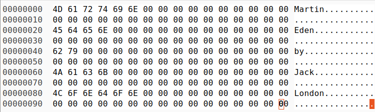

## Выбор размера хеш-таблицы.

За решением обратимся к книге Кормена "Алгоритмы. Построение и анализ". В главе 12 можно найти следующую цитату: «Хорошие результаты обычно получаются, если выбрать в качестве m простое число, далеко стоящее от степеней двойки». m - число возможных хеш-значений, в моей реализацией m - это количество списков в хеш-таблице. Так же хотелось бы, чтобы *load factor > 7*. *load factor* - это среднее количество элементов, приходящихся на каждую ячейку таблицы. Зачем его делать таким большим, если его стараются уменьшать? Это делается, чтобы лучше было видно, насколько равномерно хеш-функции распределяют по хеш-таблице.  Если бы *load factor* был оптимальным и подбирался для ускорения работы хеш-таблицы, то при исследовании распределения пики загруженности отдельных ячеек были бы не так видны и могло бы показаться, что распределение получается близким к равномерному, хотя на деле это не так. 


Отсюда можно сделать вывод, что размер хеш-таблицы должен быть равен 1531. Так как $|1531 - 1024| \approx |2048 - 1531|$ и *load factor* $\approx 8$.


## Реализации хеш-функций

### Хеш-функция возвращает константу.

``` C
uint32_t HashReturnConst(const char* key, size_t len)
{
    assert((key != nullptr) && "Pointer to \'key\' is NULL!!!\n");
    assert((len != 0)       && "Len is invalid!!!\n");

    return 0;
}
```

Данная хеш-функция, всегда возвращает 0, и будет заполнена лишь 1 ячейка, это влияет на время работы, оно увеличится.

График (в увеличенном масштабе):
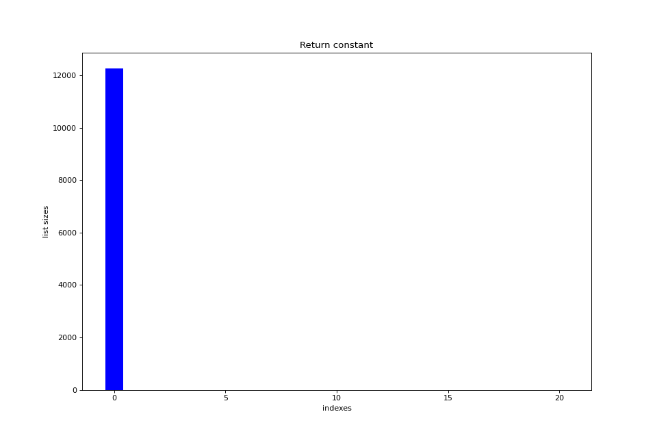

Среднее квадратичное отклонение $\sigma = 313.28$. Проблема в хешировании очевидна, заполняется только 1 ячейка.

### Хеш-функция возвращает ASCII код первого символа в слове.

``` C
uint32_t HashReturnFirstASCIICode(const char* key, size_t len)
{
    assert((key != nullptr) && "Pointer to \'key\' is NULL!!!\n");
    assert((len != 0)       && "Len is invalid!!!\n");

    return key[0];
}
```

Диаграмма во всем масштабе:
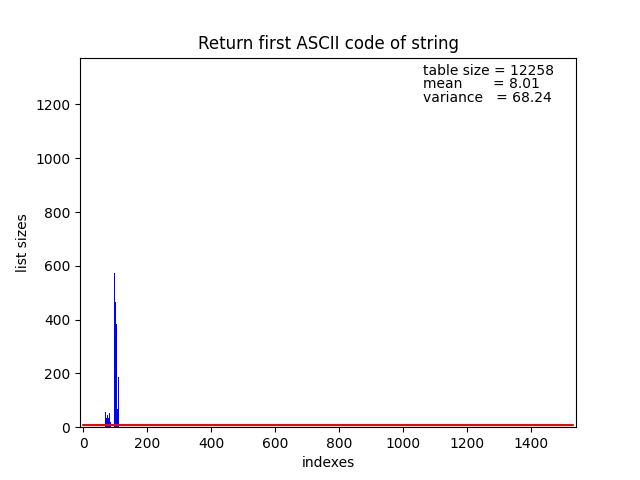

Среднее квадратичное отклонение $\sigma = 68.24$. Хеширование получается неравномерное, так как первый ASCII код слова - это латинская буква. А их коды лежат в диапазоне от 65 до 122. Остальные ячейки не заполняются.

### Хеш-функция возвращает длину слова.

``` C
uint32_t HashReturnStrlen(const char* key, size_t len)
{
    assert((key != nullptr) && "Pointer to \'key\' is NULL!!!\n");
    assert((len != 0)       && "Len is invalid!!!\n");

    return len;
}
```

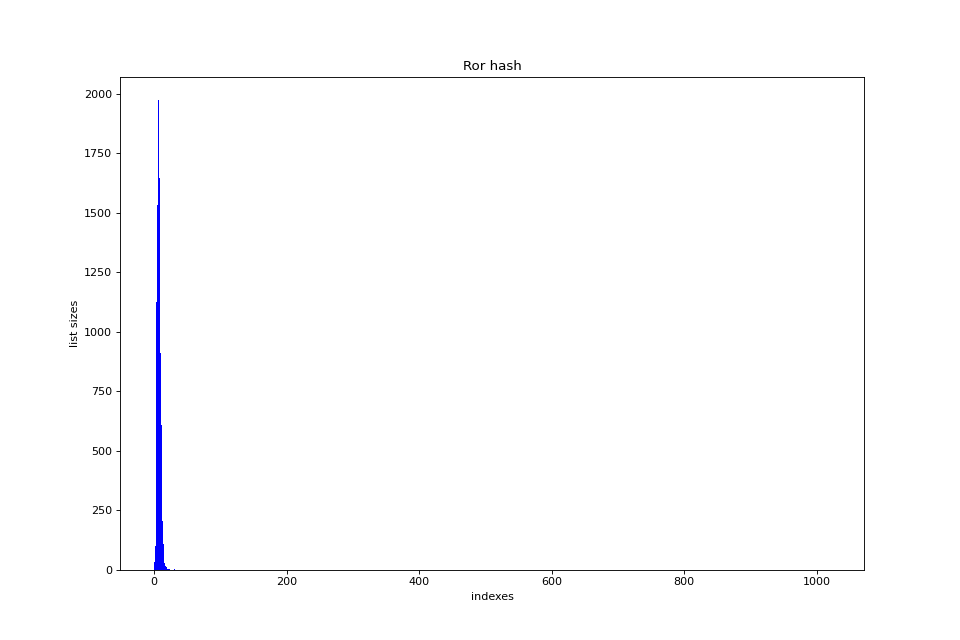

Среднее квадратичное отклонение $\sigma = 104.68$. Так как длина английских слов не превышает 45, а в моем случае 31, то остальные ячейки не заполнятся никогда, что говорит о её плохом распределении.

### Хеш-функция возвращает сумму ASCII кодов в слове.

``` C
uint32_t HashReturnSumCodes(const char* key, size_t len)
{
    assert((key != nullptr) && "Pointer to \'key\' is NULL!!!\n");
    assert((len != 0)       && "Len is invalid!!!\n");

    uint32_t control_sum = 0;

    for (int i = 0; i < len; i++)
    {
        control_sum += key[i];
    }

    return control_sum;
}
```

Рассмотрим, распределение данной хеш-функции на маленьком датасете. Датасет состоит из 1550 уникальных cлов. Размер хеш-таблицы выберем, равный $193$, так как $193$ - самое отдаленное простое число от степеней двоек и *load factor* $\approx 8$.

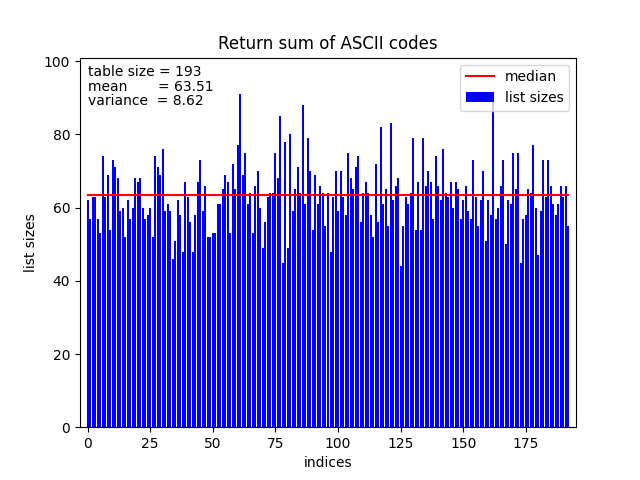

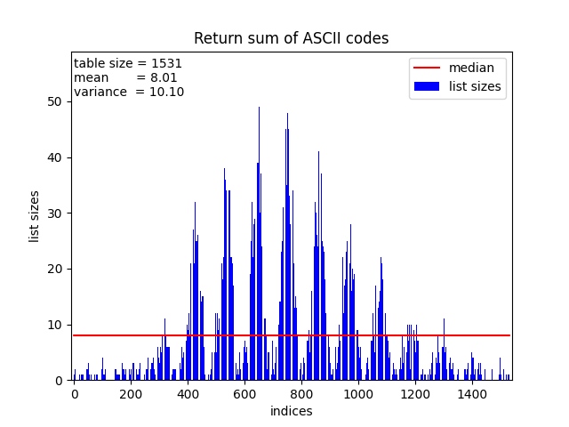

Диаграмма при размере хеш-таблицы = 1531 и полном датасете из 142049 слов.
Среднее квадратичное отклонение $\sigma = 10.10$. 

Данная хеш-функция имеет не лучшее распределение. Так как английские слова имеют определенную зависимость последовательности символов в слове, то из-за этого какие-то суммы кодов встречаются часто, а другие нет, из-за этого на графике видны подобные возвышенности.

Так же данная хеш-функция имеет ограничение на диапазон возможных значений. 
Так как в английском слове длина слова не превышает 45 букв, то максимально возможное значение = 45 * 'z' = 45 * 122 = 5490. То есть при количестве оригинальных слов > 5490, то по индексам от 5491 и т.д. будут пустые списки.

### Хеш-функция возвращает RorHash.

Алгоритм вычисления вычисления функции:
$$hash[0] = key[0]$$
$$hash[n] = ror(hash[n-1]) \oplus key[n]$$

ror() - циклический сдвиг вправо

``` C
inline static uint32_t RORCalculate(uint32_t hash)
{
    return hash >> 1 | hash << 31;
}

uint32_t HashRorFunction(const char* key, size_t len)
{
    assert((key != nullptr) && "Pointer to \'key\' is NULL!!!\n");
    assert((len != 0)       && "Len is invalid!!!\n");

    uint32_t hash   = 0;

    for (int i = 0; i < len; i++)
    {
        //Make cyclic shift right
        hash = RORCalculate(hash);
        hash ^= key[i];
    }

    return hash;
}
```

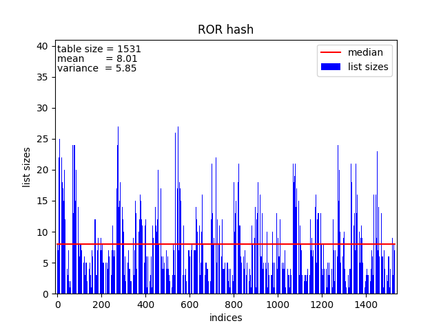

Среднее квадратичное отклонение $\sigma = 5.85$.

Код на C:
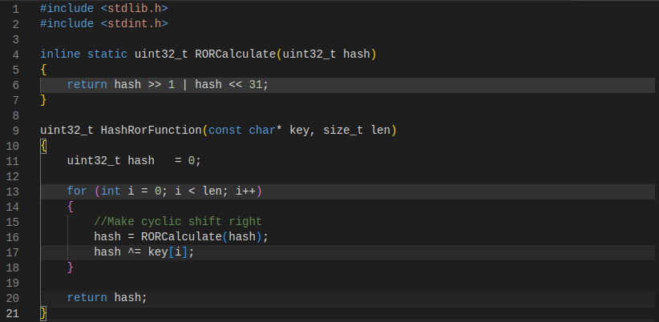

Прогонка кода через godbolt при флаге -O0:
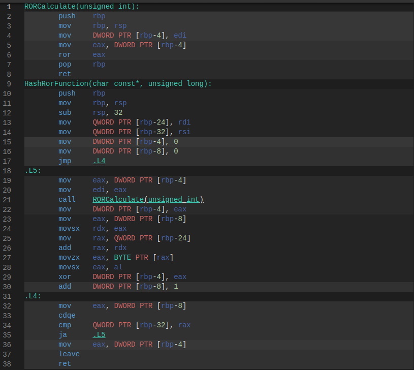

Прогонка кода через godbolt при флаге -O1:
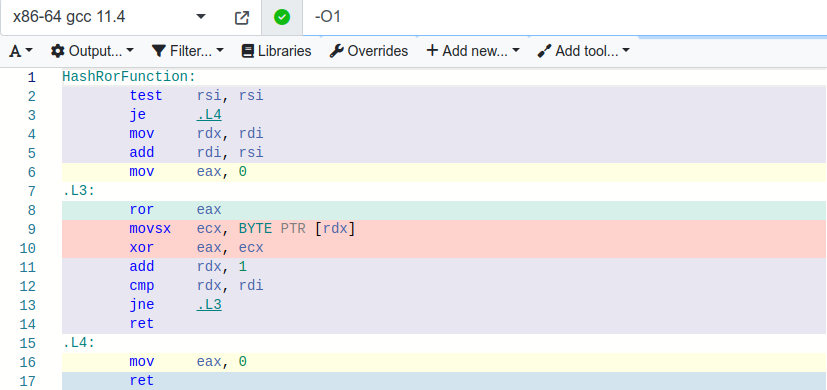

Компилятор `g++ (Ubuntu 11.4.0-1ubuntu1~22.04) 11.4.0` распознает при -O0, что 
``` C
(x >> 1) | (x << 31)
```
можно заменить на 
``` Assembly
ror eax
```
Однако, при -O1 программа упрощается и не вызывает функцию для подсчёта ror отдельно, в отличие от -O0. При -O2 и -O3 не происходит ничего интересного, так же стоит отметить, что при флаге -O0 и версии компилятора gcc < 7, компилятор не заменяет на ror.


### Хеш-функция возвращает RolHash.

Алгоритм вычисления вычисления функции:
$$hash[0] = key[0]$$
$$hash[n] = rol(hash[n-1]) \oplus key[n]$$

rol() - циклический сдвиг влево

``` C
inline static uint32_t ROLCalculate(uint32_t hash)
{
    return hash << 1 | hash >> 31;
}

uint32_t HashRolFunction(const char* key, size_t len)
{
    assert((key != nullptr) && "Pointer to \'key\' is NULL!!!\n");
    assert((len != 0)       && "Len is invalid!!!\n");

    uint32_t hash   = 0;

    for (int i = 0; i < len; i++)
    {
        //Make cyclic shift left
        hash = ROLCalculate(hash);
        hash ^= key[i];
    }

    return hash;
}
```

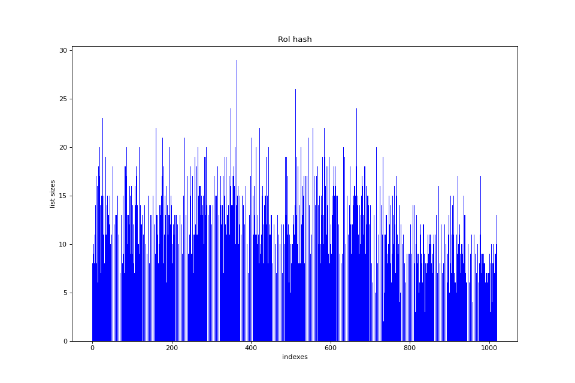

Среднее квадратичное отклонение $\sigma = 3.46$.


### Хеш-функция возвращает CRC32.

Про алгоритм CRC32 можно прочитать подробнее по [ссылке](https://en.wikipedia.org/wiki/Cyclic_redundancy_check)

``` C
uint32_t HashCrc32(const char* key, size_t len)
{
    assert((key != nullptr) && "Pointer to \'key\' is NULL!!!\n");
    assert((len != 0)       && "Len is invalid!!!\n");

    uint_least32_t crc = 0xFFFFFFFF;
    while (len--)
        crc = (crc >> 8) ^ Crc32Table[(crc ^ *key++) & 0xFF];
    return crc ^ 0xFFFFFFFF;

    return 0;
}
```

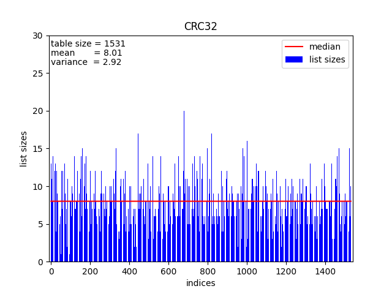

Среднее квадратичное отклонение $\sigma = 2.92$.

## Результаты

| Хеш-функция               | Среднее квадратичное отклонение |
|:-------------------------:|:-------------------------------:|
| CRC32                     | 2.92                            |
| RolHash                   | 3.46                            |
| RorHash                   | 5.85                            |
| Sum of codes(size = 1531) | 10.10                           |
| First code                | 68.24                           |
| Strlen                    | 104.68                          |
| ConstHash                 | 313.28                          |

## Анализ результатов
Из таблицы видно, что лучшим распределением обладает хеш-функция **CRC32**. В дальнейшем, будем оптимизировать хеш-таблицу с использованием CRC32.

Неплохим распределением обладает RolHash. 

# Оптимизации хеш-таблицы

В данном разделе моей целью была оптимизация хеш-таблицы и попытаться обогнать компилятор.

## Описание эксперимента

1. Создание хеш-таблицы
2. Загрузка базы данных в хеш-таблицу
3. Начало измерения времени в тактах
4. Поиск слов из базы данных
5. Конец измерения времени в тактах
6. Вывод времени поиска
7. Удаление хеш-таблицы

Поиск слов из базы данных проводился следующим образом: Ниже приведен псевдокод

```
for (i = 0; i < 3000; i++)
    for (word in data_base)
        Поиск слова word в хеш-таблице
```

## Программа без оптимизаций 

Ниже приведена таблица, содержащая результаты измерений работы хеш-таблицы с ключом оптимизаций -O0.

| Номер замера  | Время в тактах|
|:-------------:|:-------------:|
|   $1$         | $85162140512$ |
|   $2$         | $88199148064$ |
|   $3$         | $86208740000$ |
|   $4$         | $87758364768$ |
|   $5$         | $84791760288$ |

Среднее время работы: $(86,4 \pm 1,5) * 10^9$ тактов. В среднем программа работает около 27 секунд. 

## Простейшая оптимизация

Следующая оптимизация выполнит вместо нас компилятор, наша задача лишь указать ему ключ оптимизации -O3 и отключить функции дебага, такие как assert и прочее.

| Номер замера  | Время в тактах|
|:-------------:|:-------------:|
|   $1$         | $57664255360$ |
|   $2$         | $57755923008$ |
|   $3$         | $59332696992$ |
|   $4$         | $57039252000$ |
|   $5$         | $57880631968$ |

Среднее время работы: $(57,9 \pm 0,8) * 10^9$ тактов.

## Первая оптимизация с помощью intrinsic-ов

Далее наступает самая интересная часть работы. Будем пытаться обогнать компилятор.\
Запустим программу [valgrind](https://valgrind.org/) с утилитой [callgrind](https://valgrind.org/docs/manual/cl-manual.html). Далее запустим программу [KCacheGrind](https://kcachegrind.sourceforge.net/html/Home.html) для просмотра полученного результата.

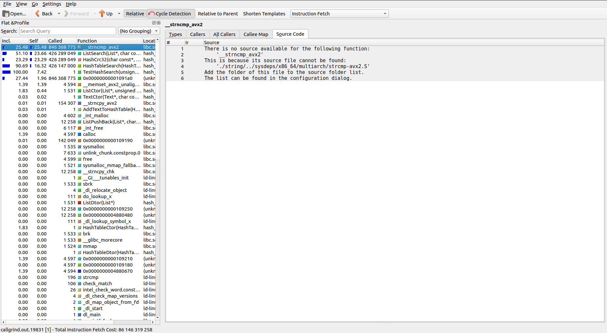

Из картинки видно, что большая часть нагрузок приходится на функцию `strncmp`. Попробуем её оптимизировать.

Заметим, что длина слов не превышает 31 символа. Значит, наши слова вмещаются в YMM-регистр. Воспользуемся этим и напишем свою `strcmp`:

``` C
int my_strcmp(const char* string1, size_t len1, const char* string2, size_t len2)
{
    if (len1 != len2)                                           //Проверка на совпадение длин слов
    {
        return 0;
    }

    __m256i reg1 = _mm256_loadu_si256((__m256i*)string1);       //Копируем string1 в YMM-регистр
    __m256i reg2 = _mm256_loadu_si256((__m256i*)string2);       //Копируем string2 в YMM-регистр
    
    __m256i cmp = _mm256_cmpeq_epi8(reg1, reg2);                //Сравниваем регистры

    unsigned int mask = (unsigned int)_mm256_movemask_epi8(cmp);

    return (mask == (unsigned int)-1);                          //Возвращаем результат сравнений
}
```

Таблица измерений:

| Номер замера  | Время в тактах|
|:-------------:|:-------------:|
|   $1$         | $42638709312$ |
|   $2$         | $43960571072$ |
|   $3$         | $44400025664$ |
|   $4$         | $44056178624$ |
|   $5$         | $44159908288$ |


Таблица сравнений с другими реализациями:

|                           | Среднее время работы в тактах | Ускорение относительно наивной реализации     | Ускорение относительно предыдущей реализации  |
|:-------------------------:|:-----------------------------:|:---------------------------------------------:|:---------------------------------------------:|
| Наивная реализация        |   $(86,4 \pm 1,5) * 10^9$     |   1                                           |   1                                           |
| Реализация с O3           |   $(57,9 \pm 0,8) * 10^9$     |   1,49                                        |   1,49                                       |  
| Ускорение strcmp          |   $(43,8 \pm 0,7) * 10^9$     |   1,97                                        |   1,32                                        |

## Вторая оптимизация с помощью встроенного ассемблера

Запускаем [valgrind](https://valgrind.org/) и наблюдаем следующее:

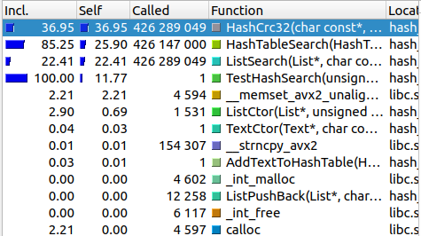

Видно, что теперь нужно оптимизировать функцию подсчёта хеша CRC32. Оказывается в ассемблере есть уже команда crc32. Воспользуемся встроенным ассемблером для написания функции хеширования:

``` C
uint32_t HashFastCrc32(const char* key, size_t len)
{
    uint32_t crc = 0xFFFFFFFF;

    asm (
        ".intel_syntax noprefix\n\t"
        "movzx  edx, BYTE PTR [%1]\n\t"
        "test    dl, dl\n\t"
        "je      .end_of_cycle\n\t"
        "add     %1, 1\n\t"
        "mov     %0, -1\n\t"
        ".next_char:\n\t"
        "add     %1, 1\n\t"
        "crc32   %0, dl\n\t"
        "movzx   edx, BYTE PTR [%1-1]\n\t"
        "test    dl, dl\n\t"
        "jne     .next_char\n\t"
        ".end_of_cycle:\n\t"
        "not     %0\n\t"
        ".att_syntax\n\t"
        : "=r"(crc)
        : "r"(key)
        : "edx"
    );

    return crc;
}
```


Таблица измерений:

| Номер замера  | Время в тактах|
|:-------------:|:-------------:|
|   $1$         | $40261211552$ |
|   $2$         | $39375098784$ |
|   $3$         | $41374334656$ |
|   $4$         | $40405351840$ |
|   $5$         | $40975126176$ |


Таблица сравнений с другими реализациями:

|                           | Среднее время работы в тактах | Ускорение относительно наивной реализации     | Ускорение относительно предыдущей реализации  |
|:-------------------------:|:-----------------------------:|:---------------------------------------------:|:---------------------------------------------:|
| Наивная реализация        |   $(86,4 \pm 1,5) * 10^9$     |   1                                           |   1                                           |
| Реализация с O3           |   $(57,9 \pm 0,8) * 10^9$     |   1,49                                        |   1,49                                       |  
| Ускорение strcmp          |   $(43,8 \pm 0,7) * 10^9$     |   1,97                                        |   1,32                                        |
| Ускорение strcmp и CRC32  |   $(40,5 \pm 0,8) * 10^9$     |   2,13                                        |   1,08                                        |


## Третья оптимизация с помощью функции, написанной ассемблера

Запустим снова [valgrind](https://valgrind.org/) и наблюдаем следующее:

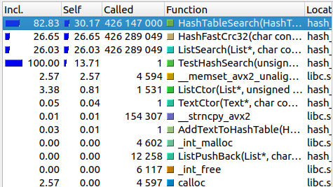

Видно, что в оптимизации нуждается функция поиска в хеш-таблице. Так как мы уже используем оптимизации в виде strcmp и CRC32, а так же наш код потерял читаемость, то решено было использовать эти 3 факта и написать продвинутую функцию поиска в хеш-таблице!

Было:

``` C
int HashTableSearch(const HashTable* const hash_table, const char* key, size_t len, error_t* error)
{
    assert((hash_table != nullptr) && "Pointer to \'hash_table\' is NULL!!!\n");
    assert((key != nullptr) && "Pointer to \'key\' is NULL!!!\n");
    assert((error != nullptr) && "Pointer to \'error\' is NULL!!!\n");

    uint32_t hash = (hash_table->hash_func(key,len)) % hash_table->size;

    *error = LIST_ERR_NO;
    int is_found = ListSearch(hash_table->data + hash, key, len, error);

    if (*error != LIST_ERR_NO)
    {
        ListPrintErrors(*error);
        *error = HASH_ERR_LIST_INVALID;
        return 0;
    }

    return is_found;
}
```

Стало:
```

```

Таблица измерений:

| Номер замера  | Время в тактах|
|:-------------:|:-------------:|
|   $1$         | $$ |
|   $2$         | $$ |
|   $3$         | $$ |
|   $4$         | $$ |
|   $5$         | $$ |


Таблица сравнений с другими реализациями:

|                           | Среднее время работы в тактах | Ускорение относительно наивной реализации     | Ускорение относительно предыдущей реализации  |
|:-------------------------:|:-----------------------------:|:---------------------------------------------:|:---------------------------------------------:|
| Наивная реализация        |   $(86,4 \pm 1,5) * 10^9$     |   1                                           |   1                                           |
| Реализация с O3           |   $(57,9 \pm 0,8) * 10^9$     |   1,49                                        |   1,49                                       |  
| Ускорение strcmp          |   $(43,8 \pm 0,7) * 10^9$     |   1,97                                        |   1,32                                        |
| Ускорение strcmp и CRC32  |   $(40,5 \pm 0,8) * 10^9$     |   2,13                                        |   1,08                                        |
| Ускорение HashTableSearch |                               |                                               |                                               |

# Вывод

# Благодарности

# Библиографический список

# Приложение

