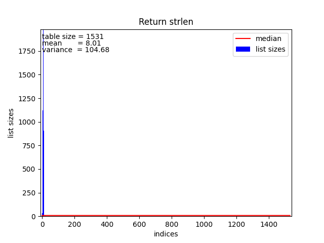
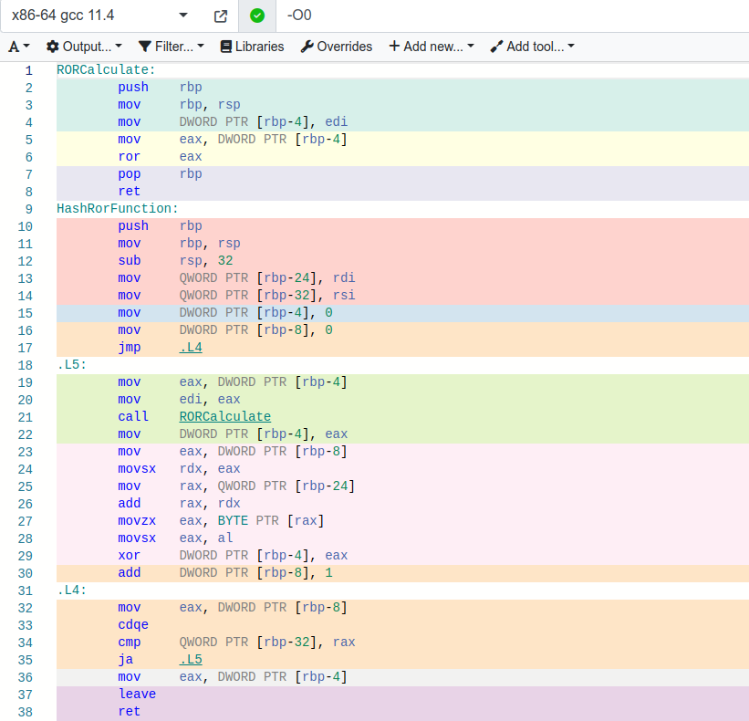
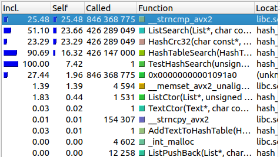

# Лабораторная работа
# Тема: "Хеш-таблица"
<br>

### Александров Олег
### Б05-331 
### 11.04.2024 

<br>

# Содержание
1. [Теоретическая справка](#теоретическая-справка)
2. [Цель работы](#цель-работы)
3. [Сравнительный анализ хеш-функций](#сравнительный-анализ-хеш-функций)
    1. [Реализация хеш-функций](#реализации-хеш-функций)
    2. [Описание эксперимента](#описание-эксперимента)
    3. [Подготовка базы данных](#подготовка-базы-данных)
    4. [Выбор размера хеш-таблицы](#выбор-размера-хеш-таблицы)
    5. [Хеш-функция, которая возвращает:](#хеш-функция-которая-возвращает)
        1. [константу](#1-константу)
        2. [ASCII код первого символа](#2-ascii-код-первого-символа-в-слове)
        3. [длину слова](#3-длину-слова)
        4. [сумму ASCII кодов в слове](#4-сумму-ascii-кодов-в-слове)
        5. [RorHash](#5-RorHash)
        6. [RolHash](#6-RolHash)
        7. [CRC32Hash](#7-CRC32Hash)
    6. [Результаты](#результаты)
    7. [Анализ результатов](#анализ-результатов)
4. [Оптимизации хеш-таблицы](#оптимизации-хеш-таблицы)
    1. [Описание эксперимента](#описание-эксперимента)
    2. [Программа без оптимизаций (v.0)](#программа-без-оптимизаций-v0)
    3. [Простейшая оптимизация без ассемблера (v.1)](#простейшая-оптимизация-v1)
    4. [Первая оптимизация с помощью intrinsic'ов (v.2)](#первая-оптимизация-с-помощью-intrinsicов-v2)
    5. [Вторая оптимизация с помощью встроенного ассемблера (v.3.1 и v.3.2)](#вторая-оптимизация-с-помощью-встроенного-ассемблера-v31-и-v32)
    6. [Третья оптимизация с помощью функции, написанной на ассемблере (v.4)](#третья-оптимизация-с-помощью-функции-написанной-на-ассемблере-v4)
    7. [Расчет коэффициента полезного действия](#расчет-коэффициента-полезного-действия)
5. [Вывод](#вывод)
6. [Благодарности](#благодарности)
7. [Литература](#литература)
8. [Интернет ресурсы](#интернет-ресурсы)

# Теоретическая справка

**Хеш-таблица** - структура данных, которая хранит некоторые элементы и предоставляет возможность их быстрого добавления, удаления и поиска. Элементы хеш-таблицы называются ключами.

**Хеш-функция** - это функция, которая отображает множество ключей $U$ на ячейки хеш-таблицы:
$$h: U \rightarrow {0, 1, \ldots, m-1}$$

**Коллизией** назовем ситуацию, когда значения хеш-функций двух разных ключей совпадают.

Общий принцип работы хеш-таблиц следующий: перед каждым запросом некоторая хеш-функция сопоставляет ключу натуральное число - хеш, по которому определяется дальнейшая обработка запроса. При хорошо подобранной хеш-функции и некоторых допущениях можно добиться того, что все запросы работают за $O(1)$.

Для решения коллизий было решено реализовать хеш-таблицу **методом цепочек**, который состоит в том, что мы храним не пару (ключ, значение), а храним цепочку из ключей. В качестве цепочки было решено использовать [двусвязный список](https://github.com/Ch1n-ch1nless/MY_LIST). Однако, стоит отметить, что в данной работе односвязный список так же можно использовать.

Чтобы данная структура данных обрабатывала запросы за $O(1)$ необходим ряд следующих требований:

*  хеш-функция должна равномерно распределять элементы по таблице, чтобы списки получались примерно одинаковой длины
*  алгоритм пересчета хеша должен для одного и того же ключа всегда выдавать один и тот же хеш
*  алгоритм пересчета хеша должен работать быстро

# Цель работы: 
Найти хэш-функцию с равномерным распределением, оптимизировать производительность функций хеш-таблицы и попробовать достичь большей производительности, чем -О3.

# Сравнительный анализ хеш-функций

В данном разделе моей работы я искал хеш-функцию с равномерным распределением.

## Описание эксперимента

В моей реализации хеш-таблицы ключами являются английские слова. В хеш-таблицу загружаются английские слова из базы данных, после печатаются размеры каждого списка из хеш-таблицы. Рассчитывается средний размер каждого списка и среднеквадратичное отклонение. Так как для каждой дальнейшей хеш-функции размер хеш-таблицы и базы данных будет постоянен, то выбор функции с лучшим распределением будет зависеть от среднеквадратичного отклонения.

## Подготовка базы данных

В качестве базы данных слов для хеш-таблицы был взят рассказ Джека Лондона "Мартин Иден".
В этом рассказе **142049** слов, из которых **12258** уникальных. Так же длина слов не превышает **31**. Это пригодится далее.
Перед использованием текст обрабатывается следующим образом:
*   Удаляются все знаки препинания и числа из текста.
*   Все слова выравниваются до длины в 32 символа.

Выравнивание происходит с помощью добавления к словам '\0'. На картинке показано, как выглядит готовый датасет [Data/CleanFile.txt]().


## Выбор размера хеш-таблицы.

За решением обратимся к книге "Введение в алгоритмы" под авторством Кормена и других [[2]](#литература). В главе 11 можно найти следующую цитату: 
> «Хорошие результаты обычно получаются, если выбрать в качестве m простое число, далеко стоящее от степеней двойки». 

m - число возможных хеш-значений, в моей реализацией m - это количество списков в хеш-таблице. 

Почему Кормен и другие авторы рекомендует брать именно такое число? Для начала разберемся, почему m должно быть простым.

Пусть $i$ - индекс в массиве списков, $n$ - результат хеширования ключа и $m$ - размер хеш-таблицы. Рассмотрим, как вычисляется индекс списка в хеш-таблице: 
$$i \equiv n \pmod{m}$$

Предположим, что $m$ - не простое число, а составное, тогда возможен такой случай, что $n$ и $m$ имеют общие делители $\Rightarrow$ $GCD(n, m)$   $\mid$   $i$. Так как каждый индекс делится на НОД(n, m), то соответственно заполнятся лишь $\frac{m}{GCD(n, m)}$. И если $GCD(n, m) \neq 1$, то тогда часть ячеек в массиве останется пустым, и мы не получим равномерного распределения. Чтобы избежать подобного, нужно, чтобы $m$ и $n$ были взаимно просты. Чтобы достичь этого, достаточно взять в качестве $m$ простое число.

Теперь ответим на вопрос: "Почему число должно далеко стоять от степеней двоек?" 
Рассмотрим, $m=2^p$, тогда $i$ - это просто младших $p$ бит. И распределение будет зависит от вероятностного распределения между $p$ младшими битами. Если хеш-функция гарантирует, что все наборы младших битов постоянны, то будет равномерное распределение, иначе нет. Доказательство того, что лучший размер хеш-таблицы - это простое число, далеко стоящее от степеней, очень большее, поэтому интересующиеся читатели могут ознакомиться с ним в книге "Искусство Программирования. Том 3" Дональда Кнута [[3]](#литература).

Так же хотелось бы, чтобы *load factor > 7*. *load factor* - это среднее количество элементов, приходящихся на каждую ячейку таблицы. Зачем его делать таким большим, если его стараются уменьшать? Это делается для лучшей демонстративности, поэтому и мы подбирали оптимальный размер хеш-таблицы и *load factor*.

Отсюда можно сделать вывод, что размер хеш-таблицы должен быть равен 1531 ($|1531 - 1024| \approx |2048 - 1531|$ и *load factor* $\approx 8$).

## Хеш-функция, которая возвращает:

### 1) Константу.

``` C
uint32_t HashReturnConst(const char* key, size_t len)
{
    return 0;
}
```

Данная хеш-функция, всегда возвращает 0, и будет заполнена лишь 1 ячейка, это влияет на время работы, оно увеличится.

График:


Среднее квадратичное отклонение $\sigma = 313.28$. Проблема в хешировании очевидна, заполняется только 1 ячейка.

### 2) ASCII код первого символа в слове.

``` C
uint32_t HashReturnFirstASCIICode(const char* key, size_t len)
{
    return key[0];
}
```

График:


Среднее квадратичное отклонение $\sigma = 68.24$. Хеширование получается неравномерное, так как первый ASCII код слова - это латинская буква. А их коды лежат в диапазоне от 65 до 122. Остальные ячейки не заполняются.

### 3) Длину слова.

``` C
uint32_t HashReturnStrlen(const char* key, size_t len)
{
    return len;
}
```
График:



Среднее квадратичное отклонение $\sigma = 104.68$. Так как длина английских слов не превышает 45, то ячейки с номерами > 45 не будут заполнены. Имеем, что распределение слов по длине в большинстве случаев будет неравномерным.

### 4) Сумму ASCII кодов в слове.

``` C
uint32_t HashReturnSumCodes(const char* key, size_t len)
{
    uint32_t control_sum = 0;

    for (int i = 0; i < len; i++)
    {
        control_sum += key[i];
    }

    return control_sum;
}
```

Рассмотрим, распределение данной хеш-функции на маленьком размере, который равен $193$. 

График:


Как видно из графика, средний размер списка $\approx 63,51$ и среднее квадратичное отклонение $\approx 8,62$. Относительное отклонение $\approx 13.6$%. Это неплохой результат относительно предыдущих, но время поиска значения в хеш-таблице выросло, так как средняя длина списка больше, чем у остальных. Проверим теперь данную хеш-функции при размере $3049$.

График:


По графику видно, что распределение данной хеш-функции не равномерно и хуже, чем при размере 193. Так же относительное отклонение увеличилось и стало равным $\approx 50$%.

**Моя гипотеза, почему она не эффективна при большом размере хеш-таблицы:**:

Распределение вышло таким из-за того, что английские слова имеют определенную зависимость в последовательности символов в слове, то из-за этого какие-то суммы кодов встречаются часто, а другие нет, из-за этого на графике видны подобные возвышенности.

Так же данная хеш-функция имеет ограничение на диапазон возможных значений. 
Так как в английском слове длина слова не превышает 45 букв, то максимально возможное значение = 45 * 'z' = 45 * 122 = 5490. То есть при количестве оригинальных слов > 5490, то по индексам от 5491 и т.д. будут пустые списки. То есть данная хеш-функция плохо расширяема. 

### 5) RorHash.

Алгоритм вычисления вычисления функции:
$$hash[0] = key[0]$$
$$hash[n] = ror(hash[n-1]) \oplus key[n]$$

ror() - циклический сдвиг вправо

``` C
inline static uint32_t RORCalculate(uint32_t hash)
{
    return hash >> 1 | hash << 31;
}

uint32_t HashRorFunction(const char* key, size_t len)
{
    uint32_t hash   = 0;

    for (int i = 0; i < len; i++)
    {
        //Make cyclic shift right
        hash = RORCalculate(hash);
        hash ^= key[i];
    }

    return hash;
}
```
График:


Среднее квадратичное отклонение $\sigma = 5.85$.

Рассмотрим, как godbolt транслирует код в ассемблер:

Прогонка кода через godbolt при флаге -O0:


Прогонка кода через godbolt при флаге -O1:


Компилятор `g++ (Ubuntu 11.4.0-1ubuntu1~22.04) 11.4.0` распознает при -O0, что 
``` C
(x >> 1) | (x << 31)
```
можно заменить на 
``` Assembly
ror eax
```
Однако, при -O1 программа упрощается и не вызывает функцию для подсчёта ror отдельно, в отличие от -O0. При -O2 и -O3 не происходит ничего интересного, так же стоит отметить, что при флаге -O0 и версии компилятора gcc < 7, компилятор не заменяет на ror.

### 6) RolHash.

Алгоритм вычисления вычисления функции:
$$hash[0] = key[0]$$
$$hash[n] = rol(hash[n-1]) \oplus key[n]$$

rol() - циклический сдвиг влево

``` C
inline static uint32_t ROLCalculate(uint32_t hash)
{
    return hash << 1 | hash >> 31;
}

uint32_t HashRolFunction(const char* key, size_t len)
{
    uint32_t hash   = 0;

    for (int i = 0; i < len; i++)
    {
        //Make cyclic shift left
        hash = ROLCalculate(hash);
        hash ^= key[i];
    }

    return hash;
}
```

График:


Среднее квадратичное отклонение $\sigma = 3.46$.


### 7) CRC32.

Про алгоритм CRC32 можно прочитать подробнее по [ссылке](https://en.wikipedia.org/wiki/Cyclic_redundancy_check)

``` C
uint32_t HashCrc32(const char* key, size_t len)
{
    uint_least32_t crc = 0xFFFFFFFF;
    while (len--)
        crc = (crc >> 8) ^ Crc32Table[(crc ^ *key++) & 0xFF];
    return crc ^ 0xFFFFFFFF;

    return 0;
}
```

График:


Среднее квадратичное отклонение $\sigma = 2.92$.

## Результаты

| Хеш-функция               |  Среднее квадратичное отклонение  |
|:-------------------------:|:---------------------------------:|
| CRC32                     | 2.92                              |
| RolHash                   | 3.46                              |
| RorHash                   | 5.85                              |
| Sum of codes(size = 193)  | 8.62                              |
| Sum of codes(size = 1531) | 10.10                             |
| First code                | 68.24                             |
| Strlen                    | 104.68                            |
| ConstHash                 | 313.28                            |

## Анализ результатов
Из таблицы видно, что лучшим распределением обладает хеш-функция **CRC32**. В дальнейшем, будем оптимизировать хеш-таблицу с использованием CRC32.

Хорошим распределением обладает RolHash. Стоит отметить, что и SumCodes при маленьком объеме данных обладает неплохим распределением.

# Оптимизации хеш-таблицы

В данном разделе моей целью была оптимизация хеш-таблицы и попытаться обогнать компилятор.

## Описание эксперимента

1. Создание хеш-таблицы
2. Загрузка базы данных в хеш-таблицу
3. Начало измерения времени в тактах
4. Поиск слов из базы данных
5. Конец измерения времени в тактах
6. Вывод времени поиска
7. Удаление хеш-таблицы

Поиск слов из базы данных проводился следующим образом: Ниже приведен псевдокод

```
for (i = 0; i < 3000; i++)
    for (word in data_base)
        Поиск слова word в хеш-таблице
```

В дальнейшем, каждой оптимизации присвоим номер версии программы.

## Программа без оптимизаций v.0

Ниже приведена таблица, содержащая результаты измерений работы хеш-таблицы с ключом оптимизаций -O0.

| Номер замера  | Время в тактах|
|:-------------:|:-------------:|
|   $1$         | $85162140512$ |
|   $2$         | $88199148064$ |
|   $3$         | $86208740000$ |
|   $4$         | $87758364768$ |
|   $5$         | $84791760288$ |

Среднее время работы: $(86,4 \pm 1,5) * 10^9$ тактов. В среднем программа работает около 27 секунд. 

## Простейшая оптимизация v.1

Следующая оптимизация выполнит вместо нас компилятор, наша задача лишь указать ему ключ оптимизации -O3 и отключить функции дебага, такие как assert и прочее.

| Номер замера  | Время в тактах|
|:-------------:|:-------------:|
|   $1$         | $57664255360$ |
|   $2$         | $57755923008$ |
|   $3$         | $59332696992$ |
|   $4$         | $57039252000$ |
|   $5$         | $57880631968$ |

|                                   | Среднее время работы в тактах | Ускорение относительно O0 (v.0) | Ускорение относительно O3 (v.1) | Ускорение относительно предыдущей реализации  |
|:---------------------------------:|:-----------------------------:|:--------------------------:|:--------------------------:|:---------------------------------------------:|
| Наивная реализация        (v.0)   |   $(86,4 \pm 1,5) * 10^9$     |   1,00                     |   0,67                        |   1                                           |
| Реализация с O3           (v.1)   |   $(57,9 \pm 0,8) * 10^9$     |   1,49                     |   1,00                     |   1,49                                       |  

В среднем, программа работает около $18$ секунд.

## Первая оптимизация с помощью intrinsic'ов v.2

Далее наступает самая интересная часть работы. Будем пытаться обогнать компилятор.\
Запустим программу [valgrind](https://valgrind.org/) с утилитой [callgrind](https://valgrind.org/docs/manual/cl-manual.html). Далее запустим программу [KCacheGrind](https://kcachegrind.sourceforge.net/html/Home.html) для просмотра полученного результата.



Из картинки видно, что большая часть нагрузок приходится на функцию `strncmp`. Попробуем её оптимизировать.

Заметим, что длина слов не превышает 31 символа. Значит, наши слова вмещаются в YMM-регистр. Воспользуемся этим и напишем свою `strcmp`:

<details>
<summary>my_strcmp</summary>

``` C
int my_strcmp(const char* string1, size_t len1, const char* string2, size_t len2)
{
    if (len1 != len2)                                           //Проверка на совпадение длин слов
    {
        return 0;
    }

    __m256i reg1 = _mm256_loadu_si256((__m256i*)string1);       //Копируем string1 в YMM-регистр
    __m256i reg2 = _mm256_loadu_si256((__m256i*)string2);       //Копируем string2 в YMM-регистр
    
    __m256i cmp = _mm256_cmpeq_epi8(reg1, reg2);                //Сравниваем регистры

    unsigned int mask = (unsigned int)_mm256_movemask_epi8(cmp);

    return (mask == (unsigned int)-1);                          //Возвращаем результат сравнений
}
```

</details>
<br>

Таблица измерений:

| Номер замера  | Время в тактах|
|:-------------:|:-------------:|
|   $1$         | $42638709312$ |
|   $2$         | $43960571072$ |
|   $3$         | $44400025664$ |
|   $4$         | $44056178624$ |
|   $5$         | $44159908288$ |


Таблица сравнений с другими реализациями:

|                                   | Среднее время работы в тактах | Ускорение относительно O0 (v.0) | Ускорение относительно O3 (v.1) | Ускорение относительно предыдущей реализации  |
|:---------------------------------:|:-----------------------------:|:--------------------------:|:--------------------------:|:---------------------------------------------:|
| Наивная реализация        (v.0)   |   $(86,4 \pm 1,5) * 10^9$     |   1,00                     |   0,67                        |   1                                           |
| Реализация с O3           (v.1)   |   $(57,9 \pm 0,8) * 10^9$     |   1,49                     |   1,00                     |   1,49                                       |  
| Ускорение strcmp          (v.2)   |   $(43,8 \pm 0,7) * 10^9$     |   1,97                     |   1,32                     |   1,32                                        |

Мы смогли обогнать компилятор на 32%. Так же программа в среднем работает около 13 секунд.

## Вторая оптимизация с помощью встроенного ассемблера v.3.1 и v.3.2

Запускаем [valgrind](https://valgrind.org/) и наблюдаем следующее:


Видно, что теперь нужно оптимизировать функцию подсчёта хеша CRC32. Оказывается в ассемблере есть уже команда crc32. Воспользуемся встроенным ассемблером для написания функции хеширования:

<details>
<summary>HashFastCrc32(v.3.1)</summary>

``` C
uint32_t HashFastCrc32(const char* key, size_t len)
{
    uint32_t crc = 0xFFFFFFFF;

    asm (
        ".intel_syntax noprefix\n\t"
        "movzx  edx, BYTE PTR [%1]\n\t"         //Загружаем символ в регистр edx
        "test    dl, dl\n\t"                    //Проверка на равенство символа с '\0'
        "je      .end_of_cycle\n\t"             //Если равен, то выходим из цикла
        "add     %1, 1\n\t"                     //Иначе key += 1 и crc = (uint32_t)-1
        "mov     %0, -1\n\t"
        ".next_char:\n\t"
        "add     %1, 1\n\t"
        "crc32   %0, dl\n\t"                    //Операция хеширования CRC32
        "movzx   edx, BYTE PTR [%1-1]\n\t"      //<-+ Смотрим на следующий символ и проверяем его на равенство с '\0'
        "test    dl, dl\n\t"                    //</
        "jne     .next_char\n\t"
        ".end_of_cycle:\n\t"
        "not     %0\n\t"                        //crc = crc ^ 0xFFFFFFFF
        ".att_syntax\n\t"
        : "=r"(crc)
        : "r"(key)
        : "edx"
    );

    return crc;
}
```
</details>
<br>

Таблица измерений:

| Номер замера  | Время в тактах|
|:-------------:|:-------------:|
|   $1$         | $40261211552$ |
|   $2$         | $39375098784$ |
|   $3$         | $41374334656$ |
|   $4$         | $40405351840$ |
|   $5$         | $40975126176$ |


Таблица сравнений с другими реализациями:

|                                   | Среднее время работы в тактах | Ускорение относительно O0 (v.0) | Ускорение относительно O3 (v.1) | Ускорение относительно предыдущей реализации  |
|:---------------------------------:|:-----------------------------:|:--------------------------:|:--------------------------:|:---------------------------------------------:|
| Наивная реализация        (v.0)   |   $(86,4 \pm 1,5) * 10^9$     |   1,00                     |   0,67                        |   1                                           |
| Реализация с O3           (v.1)   |   $(57,9 \pm 0,8) * 10^9$     |   1,49                     |   1,00                     |   1,49                                       |  
| Ускорение strcmp          (v.2)   |   $(43,8 \pm 0,7) * 10^9$     |   1,97                     |   1,32                     |   1,32                                        |
| Ускорение strcmp и CRC32 (v.3.1)  |   $(40,5 \pm 0,8) * 10^9$     |   2,13                     |   1,43                     |   1,08                                        |

Время работы $\approx 12,5$ с. Как видно, оптимизация с помощью ассемблерной вставки дала прирост лишь в 8%, что очень мало. Я решил попробовать оптимизировать данную хеш-функцию дополнительно с помощью векторных инструкций и написания функции полностью на ассемблере.

<details>
<summary>Новый код функции(v.3.2):</summary>

```
global FastHashCRC32

section .text

;===============================================
;Fast assembler implementation of HashCRC32
;Entry: RDI =   address of string 'key'
;       RSI =   len of string 'key'
;Exit:  EAX =   value of hash
;Dstr:  No 
;===============================================
FastHashCRC32:
        mov eax, -1
        crc32 rax, QWORD [rdi]
        crc32 rax, QWORD [rdi+8]
        crc32 rax, QWORD [rdi+16]
        crc32 rax, QWORD [rdi+24]
        not     eax
        ret
;===============================================
```

</details>
<br>

Таблица измерений:

| Номер замера  | Время в тактах|
|:-------------:|:-------------:|
|   $1$         | $36529807648$ |
|   $2$         | $35678269888$ |
|   $3$         | $36262572416$ |
|   $4$         | $36342348320$ |
|   $5$         | $36861952000$ |


Таблица сравнений с другими реализациями:

|                                   | Среднее время работы в тактах | Ускорение относительно O0 (v.0) | Ускорение относительно O3 (v.1) | Ускорение относительно предыдущей реализации  |
|:---------------------------------:|:-----------------------------:|:--------------------------:|:--------------------------:|:---------------------------------------------:|
| Наивная реализация        (v.0)   |   $(86,4 \pm 1,5) * 10^9$     |   1,00                     |   0,67                        |   1                                           |
| Реализация с O3           (v.1)   |   $(57,9 \pm 0,8) * 10^9$     |   1,49                     |   1,00                     |   1,49                                       |  
| Ускорение strcmp          (v.2)   |   $(43,8 \pm 0,7) * 10^9$     |   1,97                     |   1,32                     |   1,32                                        |
| Ускорение strcmp и CRC32 (v.3.2)  |   $(36,3 \pm 0,4) * 10^9$     |   2,38                     |   1,59                     |   1,21                                        |

Среднее время $\approx 11,3$ c. Действительно, программа стала работать быстрее

## Третья оптимизация с помощью функции, написанной на ассемблере v.4

Запустим снова [valgrind](https://valgrind.org/) и наблюдаем следующее:


Видно, что в оптимизации нуждается функция поиска в хеш-таблице. Так как мы уже используем оптимизации в виде strcmp и CRC32, а так же наш код потерял читаемость, то решено было использовать эти 3 факта и написать продвинутую функцию поиска в хеш-таблице!

<details>
<summary>Было:</summary>

``` C
int HashTableSearch(const HashTable* const hash_table, const char* key, size_t len, error_t* error)
{
    assert((hash_table != nullptr) && "Pointer to \'hash_table\' is NULL!!!\n");
    assert((key != nullptr) && "Pointer to \'key\' is NULL!!!\n");
    assert((error != nullptr) && "Pointer to \'error\' is NULL!!!\n");

    uint32_t hash = (hash_table->hash_func(key,len)) % hash_table->size;

    *error = LIST_ERR_NO;
    int is_found = ListSearch(hash_table->data + hash, key, len, error);

    if (*error != LIST_ERR_NO)
    {
        ListPrintErrors(*error);
        *error = HASH_ERR_LIST_INVALID;
        return 0;
    }

    return is_found;
}
```

</details>
<br>

<details>
<summary>Стало:</summary>

```
global FastHashTableSearch

section .text

;===============================================
;Fast assembler implementation of HashTableSearch
;Entry: RDI =   address of hash table
;       RSI =   address of string 'key'
;       RDX =   len of string 'key'
;Exit:  RAX =   1, if elem is in hash table, else 0
;Dstr:  No 
;===============================================
FastHashTableSearch:
;v~~~~~~~~~~Save values of registers~~~~~~~~~v
                push rcx
                push r8
;^~~~~~~~~~~~~~~~~~~~~~~~~~~~~~~~~~~~~~~~~~~~~^

;v~~~~~~~~~Prepare data for calculate~~~~~~~~~~v
                mov r8,  rsi                    ; R8  = address of string key
                mov rcx, rdx                    ; RCX = len of cycle
                mov eax, 0xFFFFFFFF             ; EAX = (uint32_t)-1
                cld
;^~~~~~~~~~~~~~~~~~~~~~~~~~~~~~~~~~~~~~~~~~~~~~^

;v~~~~~~~~~~~Calculate FastHashCrc32~~~~~~~~~~~v
                mov eax, -1
                crc32 rax, qword [rdi]          ; Hash key[0:7]
                crc32 rax, qword [rdi+8]        ; Hash key[8:15]
                crc32 rax, qword [rdi+16]       ; Hash key[16:23]
                crc32 rax, qword [rdi+24]       ; Hash key[24:31]
                not eax                         ; EAX = CRC32(key)
;^~~~~~~~~~~~~~~~~~~~~~~~~~~~~~~~~~~~~~~~~~~~~~^

                xor     edx, edx
                div     qword [rdi+8]           ; EDX = index of list in array

                lea     rax, [rdx+rdx*2]        ;<\
                sal     rax, 4                  ;<-+ RAX = address of list in which the word will be searched
                add     rax, qword [rdi]        ;</

;v~~~~~~~~~~~Search in List the key~~~~~~~~~~~~v
                vmovdqu      ymm0, [r8]         ; Load key to YMM0

                mov     rsi, QWORD [rax+32]     ; RSI = size of list
                test    rsi, rsi                ; 
                je      .IndexIsNotFound        ; if (RSI == 0) go to .IndexIsNotFound

                mov     rdx, QWORD [rax]
                xor     eax, eax

        .BeginOfCycle:                          ;<---- Begin of search cycle
                cmp     rсx, QWORD [rdx+32]
                jne     .GoToNextNode           ; if (RСX != list->data[i].size) i = list->next[i]

                vmovdqu      ymm1, [rdx]        ; Load the list->data[i].key to YMM1
                vpcmpeqb     ymm1, ymm1, ymm0   ; Compare YMM1 and YMM0
                vpmovmskb    edi, ymm1          ; EDI = mask(YMM1)

                cmp     edi, -1
                je      .EndOfFunction          ; if (key == list->data[i].key) return eax
        .GoToNextNode:
                add     rax, 1                  ;<-+ i = list->next[i]
                add     rdx, 40                 ;</

                cmp     rsi, rax                ; if (RSI != RAX) go to next node in list
                jne     .BeginOfCycle           ;----> End of search cycle

        .IndexIsNotFound:
                mov     eax, -666               ; EAX = LIST_INVALID_INDEX

;^~~~~~~~~~~~~~~~~~~~~~~~~~~~~~~~~~~~~~~~~~~~~~^

;v~~~~~~~~Return old values of registers~~~~~~~v
        .EndOfFunction:        
                pop r8
                pop rcx
;^~~~~~~~~~~~~~~~~~~~~~~~~~~~~~~~~~~~~~~~~~~~~~^

                vzeroupper
                ret

;===============================================
```

</details>
<br>

Таблица измерений:

| Номер замера  | Время в тактах|
|:-------------:|:-------------:|
|   $1$         | $33261720800$ |
|   $2$         | $33262201792$ |
|   $3$         | $33660010816$ |
|   $4$         | $33646569184$ |
|   $5$         | $33521167744$ |


Таблица сравнений с другими реализациями:

|                                   | Среднее время работы в тактах | Ускорение относительно O0 (v.0) | Ускорение относительно O3 (v.1) | Ускорение относительно предыдущей реализации  |
|:---------------------------------:|:-----------------------------:|:--------------------------:|:--------------------------:|:---------------------------------------------:|
| Наивная реализация         (v.0)  |   $(86,4 \pm 1,5) * 10^9$     |   1.00                     |   0.67                     |   1                                           |
| Реализация с O3            (v.1)  |   $(57,9 \pm 0,8) * 10^9$     |   1,49                     |   1,00                     |   1,49                                       |  
| Ускорение strcmp           (v.2)  |   $(43,8 \pm 0,7) * 10^9$     |   1,97                     |   1,32                     |   1,32                                        |
| Ускорение strcmp и CRC32  (v.3.2) |   $(36,3 \pm 0,4) * 10^9$     |   2,38                     |   1,60                     |   1,21                                        |
| Ускорение HashTableSearch  (v.4)  |   $(29,6 \pm 0,3) * 10^9$     |   2.92                     |   1.96                     |   1.23                                        |

Среднее время работы $\approx 9,1$ секунд.
Переписывание на ассемблерный файл ускорило время работы программы на 23%, это очень хороший результат, но теперь рассчитаем, стоили ли эти усилия.

## Расчет Коэффициента Полезного Действия

**КПД** - это такой коэффициент, равный $\frac{a_i}{N} \cdot 1000$, где $N$ - количество написанных строк на ассемблере, $a_i$ - ускорение программы версии i относительно программы версии i-1. Данный коэффициент показывает соотношение между улучшением производительности и ухудшением читаемости кода.

| Версия    | Ускорение относительно предыдущей версии  | Количество ассемблерных строк | КПД       |
|:---------:|:-----------------------------------------:|:-----------------------------:|:---------:|
| V.2       | 1,32                                      |   4                           | 330.00    |
| V.3.2     | 1.21                                      |   6                           | 201.67    |
| V.4       | 1.23                                      |   36                          | 33.61     |

Из данной таблицы видно, что при росте количества ассемблерных строк, уменьшается КПД. КПД служит напоминанием для программиста, что важно смотреть не только на сколько процентов программа стала работать быстрее, но и сколько усилий было затрачено. Так же поможет послужить сигналом, что стоит остановиться в ассемблерных оптимизациях, и лучше пересмотреть алгоритмическую часть программы для ускорения.

# Вывод

Оптимизации с помощью ассемблера - это сильный инструмент, который может значительно ускорить программу, но в то же время ухудшает читаемость кода и переносимость его на другие устройства. К ассемблерным оптимизациям стоит подходить осторожнее, так как в погоне за скоростью можно написать много кода и получит незначительную эффективность. В таких случаях, когда ассемблерные оптимизации не дают хорошего КПД, стоит пересмотреть алгоритмическую часть программы.

# Благодарности

Выражаю благодарность своему ментору [Мухорину Матвею](https://github.com/matmuher) за ценные советы при написания программы и рекомендации по оформлению README.md. Так же выражаю отдельную благодарность моему преподавателю [Дединскому Илье Рудольфовичу](https://github.com/ded32) за оказанную помощь и знания для написания программы и README.md.

# Литература

1. **Рэндел Э. Брайант,  Дэвид Р. О'Халларон Компьютерные системы: архитектура и программирование = Computer Systems: A Programmer's Perspective / под ред. А. Н. Киселева  — 2-е изд. — Москва: ДМК Пресс, 2022. - 994 с.**
2. **Томас Кормен, Чарльз Лейзерсон, Рональд Ривест, Клиффорд Штайн Алгоритмы: Построение и анализ = Introduction to algorithms / под ред. И. В. Красикова — 3-е изд. — Москва: Вильямс, 2013. — 1328 с.**
3. **Кнут Д. Э. Искусство программирования. Том 3. Сортировка и поиск = The Art of Computer Programming. Volume 3. Sorting and Searching / под ред. В. Т. Тертышного (гл. 5) и И. В. Красикова (гл. 6). — 2-е изд. — Москва: Вильямс, 2007. — Т. 3. — 832 с.**

# Интернет ресурсы

1. **Compiler explorer** - [godbolt.com](https://godbolt.com)
2. **Mirror of Intel Intrinsics Guide** - [laurence.com/sse](https://www.laruence.com/sse/)
3. **Лекции к.ф.-м.н., доц. МФТИ Северова Д.С.**  - [ссылка](https://www.youtube.com/watch?v=BjcJ1fK139s&list=PLthfp5exSWEoOGJTuRZAPrZNUmTrTaUZ4)

