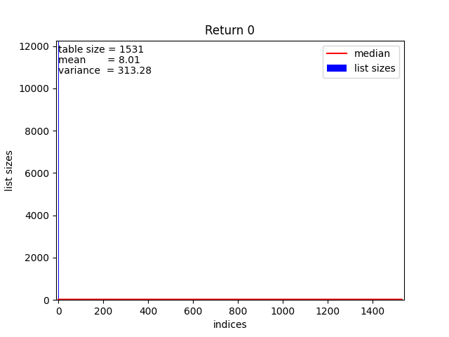
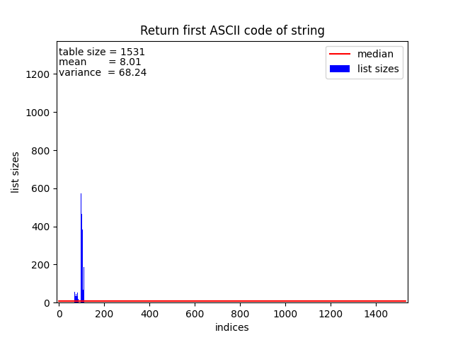
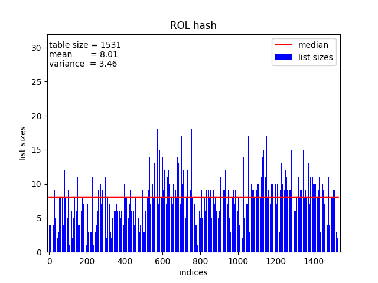

# Лабораторная работа
# Тема: "Хэш-таблица"
<br>

### Александров Олег
### Б05-331 
### 11.04.2024 

<br>

# Цель работы 
Исследовать .

# Содержание
1. [Теоретическая справка](#теоретическая-справка)
2. [Сравнительный анализ хэш-функций](#сравнительный-анализ-хэш-функций)
3. [Оптимизации хэш-таблицы](#оптимизации-хэш-таблицы)
4. [Вывод](#вывод)
5. [Благодарности](#благодарности)
6. [Библиографический список](#библиографический-список)
7. [Приложение](#приложение)

# Теоретическая справка

**Хэш-функция** - это функция, которая отображает множество ключей $U$ на ячейки хэш-таблицы:
$$h: U \rightarrow {0, 1, \ldots, m-1}$$

**Коллизией** назовем ситуацию, когда значения хэш-функций двух разных ключей совпадают.

**Хэш-таблица** - структура данных, которая хранит некоторые элементы и предоставляет возможность их быстрого добавления, удаления и поиска. Элементы хэш-таблицы называются ключами.

Общий принцип работы хэш-таблиц следующий: перед каждым запросом некоторая хэш-функция сопоставляет ключу натуральное число - хэш, по которому определяется дальнейшая обработка запроса. При хорошо подобранной хэш-функции и некоторых допущениях можно добиться того, что все запросы работают за O(1).

Для решения коллизий было решено реализовать хэш-таблицу **методом цепочек**. **Метод цепочек** состоит в том, что мы храним не пару (ключ, значение), а храним цепочку из ключей. В качестве цепочки было решено использовать [двусвязный список](https://github.com/Ch1n-ch1nless/MY_LIST).

Чтобы данная структура данных обрабатывала запросы за O(1) необходим ряд следующих требований:

*  хэш-функция должна равномерно распределять элементы по таблице, чтобы списки получались примерно одинаковой длины
*  алгоритм пересчета хэша должен для одного и того же ключа всегда выдавать один и тот же хэш
*  алгоритм пересчета хэша должен работать быстро

# Сравнительный анализ хэш-функций

Для того, чтобы качественно измерить равномерность распределения, было решено, что $loadfactor \approx 12$. $loadfactor$ - это среднее количество элементов, приходящихся на каждую ячейку таблицы. \
Исследовать равномерность распределения хэш-таблицы будем на базе рассказа Джека Лондона "Мартин Иден". В этом рассказе 142049 слов, из которых 12258 уникальных. Так мы хотим добиться, чтобы $loadfactor \approx 12$, то выберем ёмкость хэш-таблицы = $1021$(простое число). \
Далее рассмотрим различные реализации хэш-функций с их описанием и дисперсией. 

### Хэш-функция №1: Возвращает константу.

``` C
uint32_t HashReturnConst(const char* key, size_t len)
{
    assert((key != nullptr) && "Pointer to \'key\' is NULL!!!\n");
    assert((len != 0)       && "Len is invalid!!!\n");

    return 0;
}
```

Данная хэш-функция, всегда возвращает 0, и будет заполнена лишь 1 ячейка, это влияет так же на время работы, оно увеличится.

График (в увеличенном масштабе):


Среднее квадратичное отклонение $\sigma = 383.62$. Проблема в хэшировании очевидна, заполняется только 1 ячейка.

### Хэш-функция №2: Возвращает ASCII код первого символа в слове.

``` C
uint32_t HashReturnFirstASCIICode(const char* key, size_t len)
{
    assert((key != nullptr) && "Pointer to \'key\' is NULL!!!\n");
    assert((len != 0)       && "Len is invalid!!!\n");

    return key[0];
}
```

График во всем масштабе:


График в увеличенном масштабе:
.png)

Среднее квадратичное отклонение $\sigma = 83.34$. Хэширование получается неравномерное, так как первый ASCII код слова - это латинская буква или цифра. А их коды лежат в диапазоне от 48 до 122. Остальные ячейки не заполняются.

### Хэш-функция №3: Возвращает сумму ASCII кодов символов в слове.

``` C
uint32_t HashReturnSumCodes(const char* key, size_t len)
{
    assert((key != nullptr) && "Pointer to \'key\' is NULL!!!\n");
    assert((len != 0)       && "Len is invalid!!!\n");

    uint32_t control_sum = 0;

    for (int i = 0; i < len; i++)
    {
        control_sum += key[i];
    }

    return control_sum;
}
```


Среднее квадратичное отклонение $\sigma = 10.67$. 

### Хэш-функция №4: Возвращает длину слова.

``` C
uint32_t HashReturnStrlen(const char* key, size_t len)
{
    assert((key != nullptr) && "Pointer to \'key\' is NULL!!!\n");
    assert((len != 0)       && "Len is invalid!!!\n");

    return len;
}
```


Среднее квадратичное отклонение $\sigma = 128.01$. Хеш-функция возвращает длину полученного значения. Очевидно, для задач с похожей длиной ключей неэффективна(например: хранение пар имя-фамилия).

### Хэш-функция №5: Возвращает ROR xor функцию.

Алгоритм вычисления вычисления функции:
$$hash[0] = key[0]$$
$$hash[n] = ror(hash[n-1]) \oplus key[n]$$

ror() - циклический сдвиг вправо

``` C
inline static uint32_t RORCalculate(uint32_t hash)
{
    return hash >> 1 | hash << 31;
}

uint32_t HashRorFunction(const char* key, size_t len)
{
    assert((key != nullptr) && "Pointer to \'key\' is NULL!!!\n");
    assert((len != 0)       && "Len is invalid!!!\n");

    uint32_t hash   = 0;

    for (int i = 0; i < len; i++)
    {
        //Make cyclic shift right
        hash = RORCalculate(hash);
        hash ^= key[i];
    }

    return hash;
}
```


Среднее квадратичное отклонение $\sigma = 7.50$.

### Хэш-функция №6: Возвращает ROL xor функцию.

Алгоритм вычисления вычисления функции:
$$hash[0] = key[0]$$
$$hash[n] = rol(hash[n-1]) \oplus key[n]$$

rol() - циклический сдвиг влево

``` C
inline static uint32_t ROLCalculate(uint32_t hash)
{
    return hash << 1 | hash >> 31;
}

uint32_t HashRolFunction(const char* key, size_t len)
{
    assert((key != nullptr) && "Pointer to \'key\' is NULL!!!\n");
    assert((len != 0)       && "Len is invalid!!!\n");

    uint32_t hash   = 0;

    for (int i = 0; i < len; i++)
    {
        //Make cyclic shift left
        hash = ROLCalculate(hash);
        hash ^= key[i];
    }

    return hash;
}
```



Среднее квадратичное отклонение $\sigma = 4.00$.

### Хэш-функция №7: CRC32.

Про алгоритм CRC32 можно прочитать подробнее по [ссылке](https://en.wikipedia.org/wiki/Cyclic_redundancy_check)

``` C
uint32_t HashCrc32(const char* key, size_t len)
{
    assert((key != nullptr) && "Pointer to \'key\' is NULL!!!\n");
    assert((len != 0)       && "Len is invalid!!!\n");

    uint_least32_t crc = 0xFFFFFFFF;
    while (len--)
        crc = (crc >> 8) ^ Crc32Table[(crc ^ *key++) & 0xFF];
    return crc ^ 0xFFFFFFFF;

    return 0;
}
```


Среднее квадратичное отклонение $\sigma = 3.50$.

### Таблица всех дисперсий:

| Хэш-функция   | Среднее квадратичное отклонение |
|:-------------:|:-------------------------------:|
| CRC32         | 3.50                            |
| RolHash       | 4.00                            |
| RorHash       | 7.50                            |
| Sum of codes  | 10.67                           |
| First code    | 83.34                           |
| Strlen        | 128.01                          |
| ConstHash     | 383.62                          |

Из таблицы видно, что лучшим распределением обладает хэш-функция **CRC32**. В дальнейшем, будем оптимизировать хэш-таблицу с использованием CRC32.

# Оптимизации хэш-таблицы

Продолжение следует...

# Вывод

# Благодарности

# Библиографический список

# Приложение

